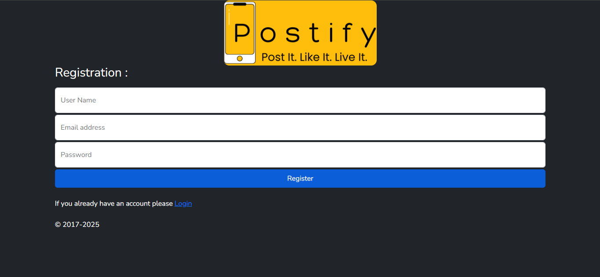
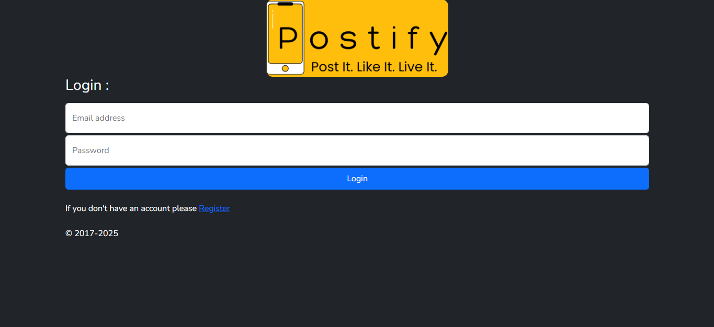
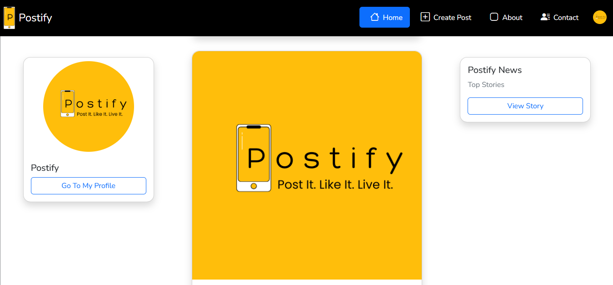
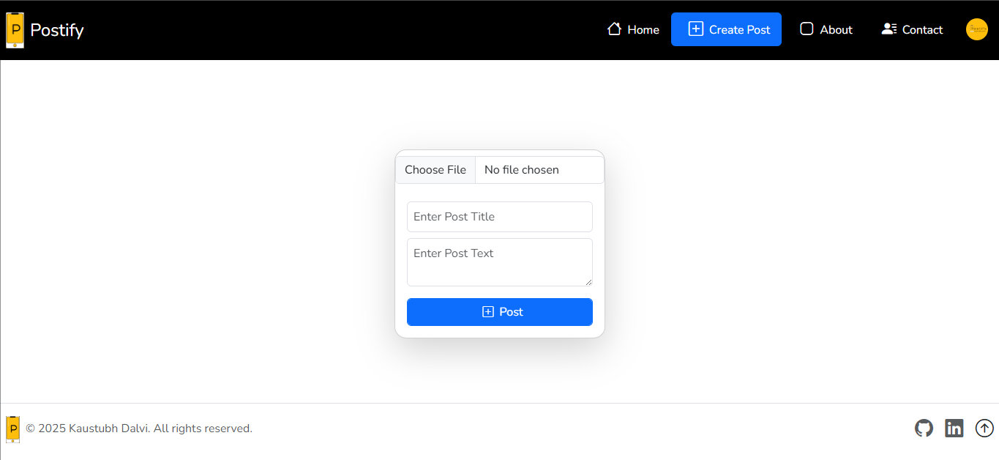
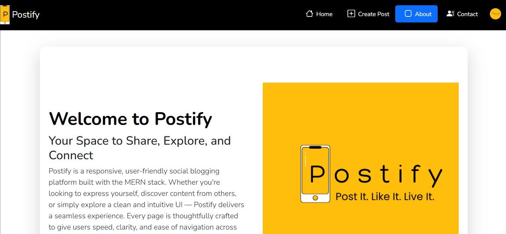
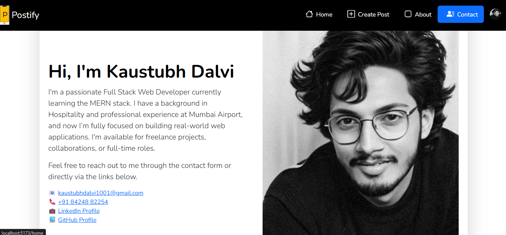
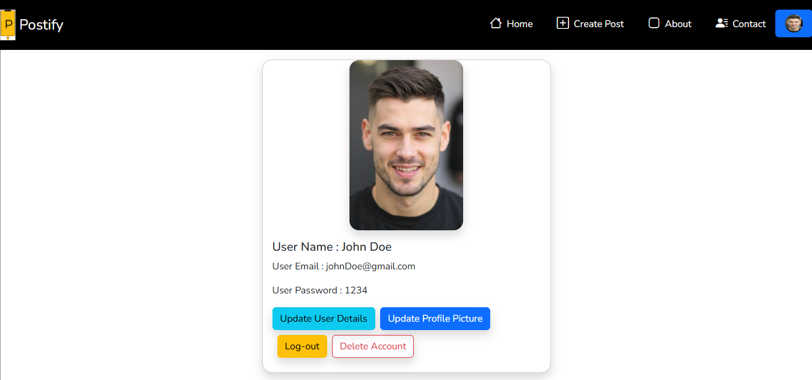

# 🚀 Postify – Frontend Social Media Web App Built with React

**Postify** is a full-featured **frontend social media web application** built using modern tools like **React**, **Vite**, **Axios**, **React Router DOM**, **Bootstrap**, **CSS Modules**, and **AOS animations**. It allows users to register, log in, create, view, like, edit, and delete posts — all without a traditional backend. The app uses **MockAPI.io** as a simulated backend to handle CRUD operations and user data persistence.

This is the most complete and refined project I’ve built in my web development journey so far.

---

## 🔗 Live Demo

🌐 [Click here to view the live app](https://kaustubh-dalvi1001.github.io/Postify-Frontend-Social-Media-Web-App-React-Vite-MockAPI-/)

---

## 📸 Screenshots

> Add relevant screenshots here from your `images/` folder.

- 
- 
- 
- 
- 
- 
- 

---

## ✨ Features

### 🔐 User Authentication
- Users register using **username**, **email**, and **password**
- No duplicate registrations allowed (unique username & email)
- Login with email & password verified against **MockAPI**
- Simulated sessions using **localStorage**

### 🏠 Home Page
- Posts from all users shown in a feed
- Users can **like posts**, and likes persist using localStorage
- Structured layout:
  - Left: Profile section
  - Center: Post feed
  - Right: Postify News and View Story (hidden on mobile)
- Responsive navbar and footer
- Navigation using **HashRouter**, **Link**, and **Routes**

### ➕ Create Post Page
- Upload photo, title, and description
- Preview image before uploading
- Base64 compression for image storage
- Alert if all three fields are empty
- Posts saved in **MockAPI** under `posts` endpoint
- Only valid users can post

### 👤 My Profile Page
- Shows user's profile details (name, email, password)
- Allows editing profile info & uploading a profile picture
- Displays user’s own posts
- Edit/Delete options available **only** for the user’s own posts
- Logout and delete account functionalities with confirmation alerts

### 📞 Contact Page
- Hero section with **my photo** and **contact links**
- Form to send feedback or messages
- Submitted messages saved in **MockAPI** under `contacts` endpoint

### ℹ️ About Page
- Contains detailed information about every page in the app
- Built using Bootstrap hero sections and screenshots of the app

### 🌐 Global Layout
- All pages include a responsive **header and footer**
- Footer includes:
  - Postify logo
  - Copyright
  - GitHub, LinkedIn, and scroll-to-top button

---

## 💡 Technologies Used

| Category       | Tools & Libraries                                                                 |
|----------------|------------------------------------------------------------------------------------|
| Framework      | [React](https://reactjs.org/), [Vite](https://vitejs.dev/)                        |
| Styling        | [Bootstrap](https://getbootstrap.com/), [CSS Modules](https://css-tricks.com/css-modules-part-1-need/) |
| State & Routing| React Hooks (`useState`, `useEffect`, `useContext`, `useReducer`), `HashRouter`   |
| Animations     | [AOS (Animate On Scroll)](https://michalsnik.github.io/aos/)                      |
| HTTP Requests  | [Axios](https://axios-http.com/)                                                  |
| Mock Backend   | [MockAPI.io](https://mockapi.io/)                                                 |
| Data Storage   | `localStorage`                                                                    |

---

## 📁 Folder Structure

```
Postify/
├── node_modules/
├── public/
│     └──images/
├── src/
│ ├── assets/
│ ├── components/
│ ├── store/
│ ├── styles/
│ ├── App.css
│ ├── App.jsx
│ └── main.jsx
├── .gitignore
├── eslint.config.js
├── index.html
├── LICENSE
├── package-lock.json
├── package.json
├── README.md
└── vite.config.js
```

---

## 🧠 What I Learned

- Building real-world app flows with React
- Authentication & data persistence using `localStorage`
- Managing state with `useContext` and `useReducer`
- Working with image upload previews and Base64 compression
- Responsive design principles
- Routing and protected page handling with `React Router`
- Integration with third-party API (MockAPI) using Axios

---

## 🙋‍♂️ Author

**Kaustubh Dalvi**  
📧 Email: [kaustubhdalvi1002@gmail.com](mailto:kaustubhdalvi1002@gmail.com)  
🔗 LinkedIn: [linkedin.com/in/kaustubh-dalvi-0431662a8](https://linkedin.com/in/kaustubh-dalvi-0431662a8)  
💻 GitHub: [github.com/Kaustubh-Dalvi1001](https://github.com/Kaustubh-Dalvi1001)

---

## 📜 License

This project is open-source and available under the [MIT License](LICENSE).

---

## 🙌 Feedback & Support

Have feedback or suggestions?  
Drop a message through the **Contact** page on the app or reach out on **LinkedIn**.

---

> Built with passion, precision, and countless cups of tea. ☕  
> – *Kaustubh Dalvi*


